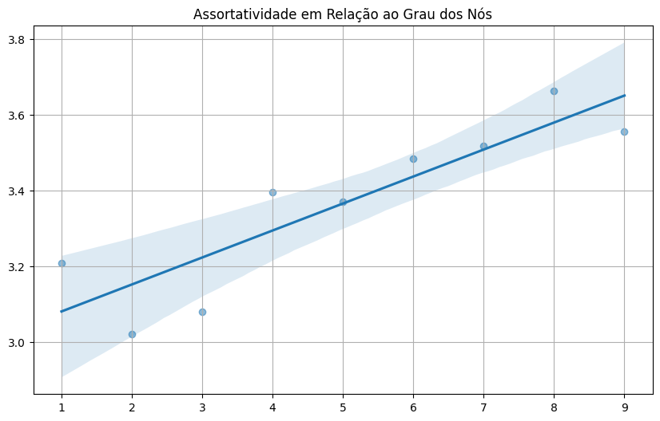
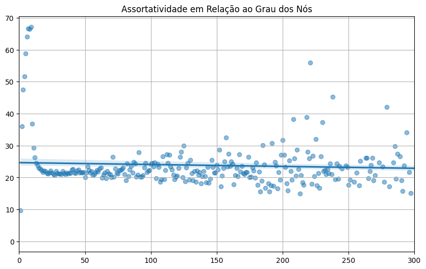
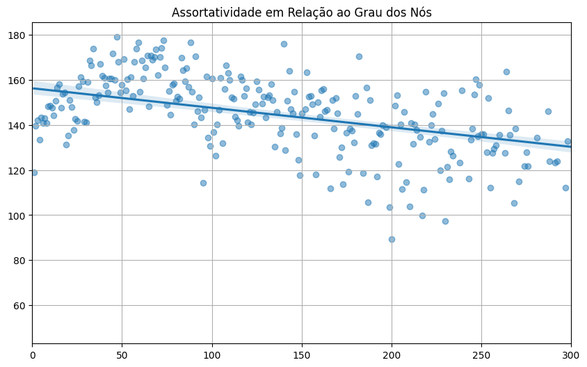
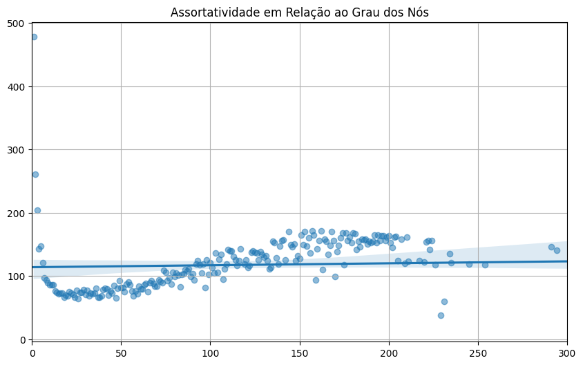
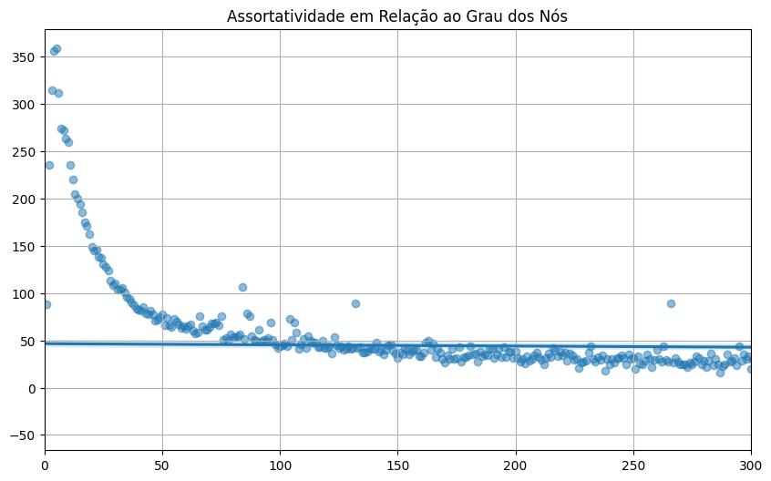

# Requirement 02 - Assortativity with respect to the degree of network nodes

## Description

In this stage, the goal is to create a scatter plot that explores the relationship between the degree of nodes in a graph and the average degree of their neighbors. The primary objective is to visualize the trend of how nodes with different degrees are connected to their neighbors in terms of the average degree. This graph helps analyze the assortativity of the network, i.e., whether nodes tend to connect to other nodes with similar or different degrees.

Assortativity is an important measure because it aids in understanding the structure and dynamics of networks. When a network is assortative, it typically forms communities or groups where nodes share common characteristics. On the other hand, a disassortative network tends to form connections between nodes with different characteristics.

For each graph presented here, the x-axis represents the degree of each node in the network, i.e., how many direct connections it has. Nodes with higher degrees will be on the right in the graph, and those with lower degrees will be on the left. The y-axis represents the average degree of the neighbors of each node. It measures the average number of connections that a node's neighbors have. A node with many connections among its neighbors will have a high value on the y-axis, indicating that its neighbors are also well-connected.

## Graphics Interpretation

If the plot shows a positive trend, it means that nodes with higher degrees tend to connect to other nodes that also have higher degrees. This indicates positive assortativity in the network. On the other hand, if the plot shows a negative trend, it means that nodes with higher degrees tend to connect to nodes with lower degrees. This indicates negative assortativity in the network. Finally, if the plot does not show a clear trend, the network can be considered neutral with regard to assortativity.

### Philadelphia Road Network

In the graph of the `roadNet-PA` network, we observe a positive trend between the degree of nodes and the average degree of their neighbors. This indicates that nodes tend to connect to other nodes with similar characteristics, suggesting greater cohesion in the network and highlighting a tendency for nodes or elements in the network to be more strongly interconnected or grouped into cohesive subgroups, communities, or clusters.

---

### Amazon co-purchasing product Network

In the second network, `Amazon0601`, the graph reveals a more neutral trend, although slightly leaning towards negative. This indicates, at least to a lesser extent, that nodes prefer to connect to others with different characteristics. Since we have only 300 nodes here, this is interesting because, given the context in which it is embedded, I personally expected a more connected network, as we are dealing with co-purchasing products.

---

### Wikipedia who-votes-on-whom Network

The third network, `Wiki-Vote`, unlike the others so far, shows a Negative trend, suggesting that nodes with higher degrees tend to connect to other nodes with lower degrees, meaning nodes with more connections prefer to link to nodes with fewer connections.

---

### Social circles from Facebook Network

In the context of `facebook_combined`, the graph reveals a distinct Neutral trend. A neutral trend in this scatter plot in a social network like Facebook suggests that there is no clear preference for connections between nodes with similar or different degrees. In this context, nodes with higher degrees do not show a strong tendency to connect only to other nodes with high degrees, nor vice versa. This may indicate a diverse social network in which users interact with a variety of contacts, regardless of the number of friends or connections those contacts have.

---

### Google web pages Network

Finally, in the `web-Google` network, we observe a trend that is closer to neutral but leaning slightly towards positive. This subtle positive trend, although in a website network, may suggest that websites tend to connect to other websites with similar degrees slightly more frequently than they would connect to websites with different degrees. As a result, assortativity is slightly positive, indicating that websites with a moderate level of popularity have a slightly greater tendency to link to other websites with similar levels of popularity.

---

In summary, the results presented in the scatter plots highlight the unique dynamics of the analyzed networks. In this sense, the graphs provide a comprehensive view of the interactions between nodes and the assortativity trends in each network, emphasizing the diversity of behaviors and structures in different network contexts.

