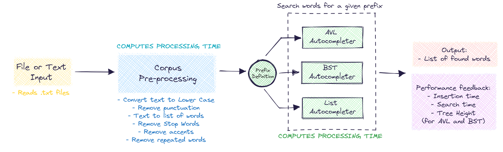
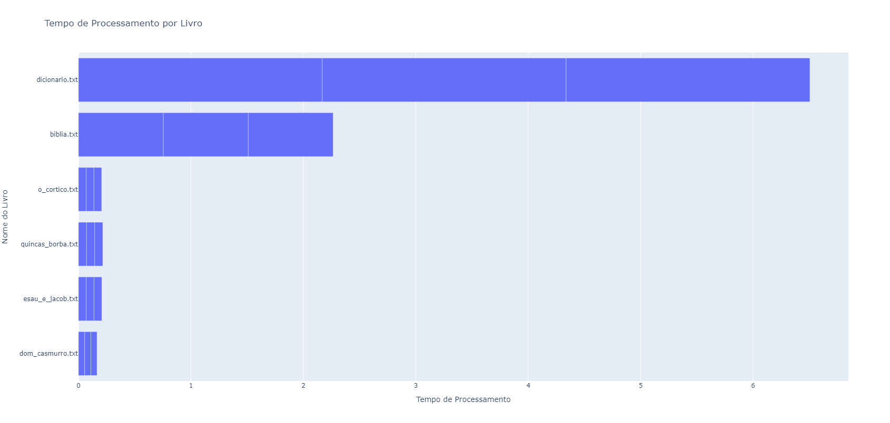
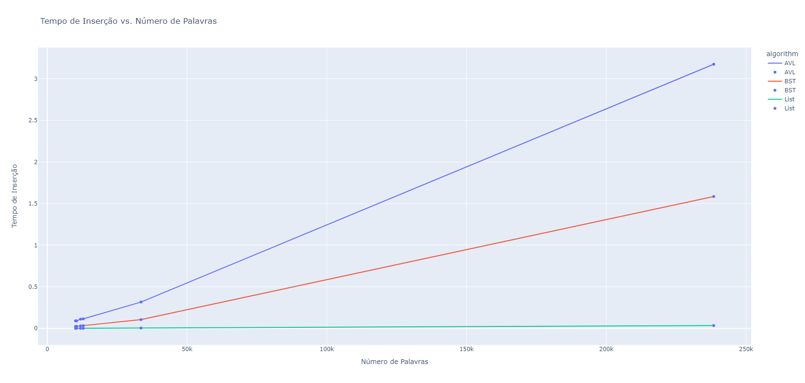
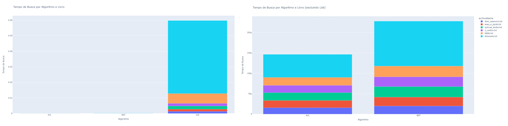

# 🌳 Autocomplete Algorithms using AVL Trees

This project is part of the first unit of the course, and here I present the results achieved by me (Miguel Euripedes) in this project. The main objective of this project is to create an autocomplete word system using an AVL tree.

To perform the autocomplete task, it is necessary to first insert a text, known as a corpus, to create a word bank for the search.

After that, this corpus is processed following predefined rules, and then it can be used to perform a search using a prefix in the resulting list of words. To carry out this activity, I implemented the list in three different data structures: the AVL tree (the main one), a Binary Search Tree (BST), and a regular list.

Finally, I conducted a performance evaluation of each one. *The portuguese video about this project can be found [here ](https://www.loom.com/share/69d7d7aec7114280ae784cc230802eba?sid=b8a60342-d507-4c22-808e-fd1fdde0de60).*

Below, I present an image of the work process carried out in the project:

---

## 📃Corpus

For the execution of this work, I used 6 datasets as corpus with the aim of evaluating performance on different databases, all in Portuguese - meaning that the preprocessing was done with this specific language in mind -, and all of them can also be characterized as books. The source of these data can be found on [Project Gutenberg](https://www.gutenberg.org/browse/languages/pt):

 * Dom Casmurro - Machado de Assis
 * Esaú e Jacó - Machado de Assis
 * Quincas Borba - Machado de Assis
 * O Cortiço - Aluísio Azevedo
 * Bible
 * Portuguese language dictionary

### 📋This Corpus pre-processing results

We processed these databases, and in the end, we obtained lists of a varying number of words with different processing times:

 * Dom Casmurro: 10111 words
 * Esaú e Jacó: 10470 words
 * Quincas Borba: 11903 words
 * O Cortiço: 12870 words
 * Bible: 33524 words
 * Dictionary: 238439 words

Below you can check the processing time for each book:

## 🎯Search results

In order to not only validate the function's operation but also to compare the results for different data structures and different input data, below I present the key findings for the conducted tests.

To standardize the tests, I performed the search in all cases for the same prefix, which in this case was **"lon"**.

### ⌛Tempo de inserção

In the image below, we can see a comparison between the insertion time and the number of words in the corpus. The blue curve represents the AVL structure, the orange one represents the BST, and finally, the green one represents the list.

Furthermore, here its provided the results of the heights for each tree with respect to each book:

|                  | Dom Casmurro   | Esaú e Jacó    | Quincas Borba  | O Cortiço      | Bible          | Dictionary     |
|------------------|----------------|----------------|----------------|----------------|----------------|----------------|
| AVL Height       | 16             | 16             | 17             | 16             | 18             | 22             |
| BST Height       | 29             | 30             | 32             | 31             | 36             | 43             |

Note the difference in heights; this is very important for us to understand as it will impact the algorithms' performance since they depend on the tree heights. The height of a tree is a crucial factor in determining how efficiently these algorithms operate. A taller tree can result in longer search times, while a shorter tree can lead to faster search operations.

### 🔎Tempo de Busca

In the images below, we can visualize the search time that each algorithm took for each book. In the first image (left), we can observe that the list took much more time than the other structures, as expected. Therefore, I decided to show in the second image (right) a more fair comparison between the other two algorithms.

# 📌Conclusion

In conclusion, this project underscores the importance of selecting the appropriate data structure for specific tasks. AVL trees, with their balanced height properties, excel in autocomplete systems, providing efficient and reliable results. In this study I also want emphasizes the significance of preprocessing the data and the seeking for standardization in algorithmic evaluations.

# References

[Ivanovitch's repository for algorithms and data structures](https://github.com/ivanovitchm/datastructure)

