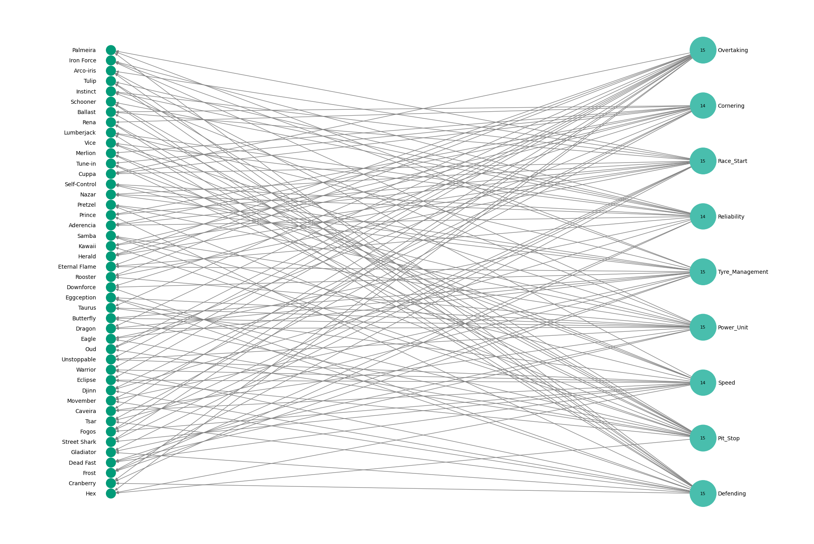

# 🖧 Graphs and 🌐Networks: An Approach Applied to F1-Clash 🏎️ 

This project is part of the second unit of the course, and here I present the results achieved by me (Miguel Euripedes) in this project. The main objective of this project is to take the knowledge of graphs and networks learned so far in the course and apply it in the context of the game [F1 Clash](https://www.hutch.io/our-games/f1-clash/) in order to analyze and create efficient combinations of components and attributes to achieve good performance in the game.

For this specific project, four tasks were proposed. The first task is related to creating and selecting the best combinations from a selected set of in-game components (car parts). The second task consists of applying the Python package [NetworkX](https://networkx.org/) to create and visualize a graph of the best scores achieved. The third task aims to utilize in-game boosts and visualize how they can relate to each other considering their internal attributes.
This should be done using NetworkX as well, but with the assistance of another package, [NXVix](https://ericmjl.github.io/nxviz/api/high-level-api/). As for the final task, the objective was to develop a specific logic that would yield the best combination involving Drivers + Boosts + Car Parts.

Finally, here I present the results achieved and explain how to achieve it, the jupyter notebook used for this project can be found [here](https://github.com/MiguelEuripedes/Algorithms_And_Data_Structure_II/blob/main/Implementations/projeto_f1clash/Notebooks/AEDII_3rd_Project.ipynb). *The portuguese video about this project can be found [here ](https://www.loom.com/share/fd764bc2a75e453ab856811f6d285438?sid=1a8dc311-663a-4711-b974-9e3087bbd3c8)*


<p align="center">


---

## 📃Task 01:

  - Goals:
    1. Create a histogram for the "Team Score" metric with all **262,144 possible vehicle configuration combinations**.
    2. Establish a **threshold** in the **histogram** that significantly reduces the possible configurations.


### Pre-Process the data

To initiate the construction of the solution, it is necessary to first create all the combinations given the number of components present in the car. Each combination is formed by a brake, a GearBox, a Rear Wing, a Front Wing, a suspension, and an Engine, and the joining of each of them is called a setup.
  
For each setup, based on the combination of its components, it is possible to achieve a certain score, called TeamScore. So, to create the dataset, we have to, using the car components (in this case, we have 8 of each), create all possible combinations, generating various setups and their respective scores. You can find the code used to perform the creation of this [CSV](https://github.com/MiguelEuripedes/Algorithms_And_Data_Structure_II/blob/main/Implementations/projeto_f1clash/Data/team_setups.csv) with all the combinations [here](https://github.com/MiguelEuripedes/Algorithms_And_Data_Structure_II/blob/main/Implementations/projeto_f1clash/PreProcessing/netX_SetupsComb.py). With that lets visualize if the results are correct:

```Python
# Import CSV
data = pd.read_csv('/team_setups.csv')
print("The data has {} rows and {} columns".format(data.shape[0], data.shape[1]))
print("The average score is {:.2f} and the standard deviation is {:.2f}".format(data['Team_Score'].mean(), data['Team_Score'].std()))
```
*Output*
> The data has 262144 rows and 7 columns
> The average score is 672.38 and the standard deviation is 67.33

Now, with everythig done we can move to the next part.

### Visualization

#### Box Plot

Using the post-processed data, before creating the histogram with the distribution of team scores, I chose to visualize these values in another way in order to obtain a more statistical breakdown beforehand. The box plot below is the visualization used for this purpose:

<p align="center">


This visualization is useful for determining the range of values to set as the **cutoff**. In this case, I chose to set it at the value of 870 because this value represents the top 31 samples, which corresponds to 0.01% of the data.

#### Histogram

With this, we can conclude the visualization of the histogram as desired.

```Python
# Create histogram
fig = px.histogram(data, x="Team_Score", color="Cutoff", title="Team Score Distribution", nbins=70, color_discrete_map=color_map)
fig.update_xaxes(title_text="Team Score")
fig.update_yaxes(title_text="Count")

# add vertical line
fig.add_shape(dict(type='line',x0=cutoff,x1=cutoff,y0=0,y1=25000,line=dict(color='#04364A', width=2)))

fig.show()
```

<p align="center">


---

## 📃Task 02:

  - Goals:
    1. Use the filter from Task 01 and the NetworkX library to create a directed graph.
    2. Choose whether the vertex size will be proportional to the "Team Score" (red vertex) or to the "Out Degree" of the cards (black vertex).
    3. With the graph from the previous item, create a graph for the Probability Density Function (PDF) of the "Out Degree" property of the vertices associated with the setup cards, using the NetworkX library and the Seaborn library (KDE function).

### Creating the Graph

To create the graph visualization, one must first create the graph. For this purpose, the networkX library and the CSV resulting from the filter performed in the previous activity were used.

  - Create Graph object and nodes:
    - The code below processes each row in the CSV, where each row represents a setup and its associated components, and while doing that adds nodes to the graph.
    - For each setup, a setup node is added with a 'setup' node type and a 'team_score' attribute indicating the setup's team score.
    - For each component associated with the setup, a component node is added, and an edge is established from the component node to the corresponding setup node in the graph.

```Python
# Create graph
G = nx.DiGraph()

# Read the CSV and add the nodes to the graph using it
with open('/content/filtered_TeamScore.csv', 'r') as csv_file:
    csv_reader = csv.DictReader(csv_file)
    for index, row in enumerate(csv_reader):
        setup = row['setup']
        team_score = float(row['Team_Score'])
        G.add_node(setup, ntype='setup', team_score=team_score)  # Add setup node with red color and lower opacity
        for component in row.keys():
            if component != 'setup' and component != 'Team_Score':
                component_node = row[component]
                G.add_node(component_node, ntype='component')  # Add component node
                G.add_edge(component_node, setup)  # Reverse the edge direction to point from component to setup
```

### Visualize graph

With the graph object created lets move to the desired plot:
  - Now, to visualize the graph representation:
    - First, I set the colors of the nodes according to their types.
    - Then, I calculate the out-degree of the 'component' nodes.
    - Now it's possible to set up the size of the nodes:
      - Here, I chose to change the size of the 'component' nodes based on their out-degree.
      - For the 'setup' nodes, I selected the size based on the team score of each setup.
    - With these settings in place, you can proceed to plot the graph.
  
```Python
# Visualize the graph with the spring layout
pos = nx.spring_layout(G, k=15 / (G.order() ** 0.5))

# Separate the nodes into setups and components
colors = ['#666666' if G.nodes[node]['ntype'] == 'component' else 'lightcoral' for node in G.nodes()]

# Calculate the out-degree of each component node.
out_degrees_component = {node: G.out_degree(node) for node in G.nodes() if G.nodes[node]['ntype'] == 'component'}

# Extract the node size based on Team_Score
setup_sizes = ode_sizieie = [800 + 100*out_degrees_component[node] if G.nodes[node]['ntype'] == 'component' else 800 + G.nodes[node]['team_score'] for node in G.nodes()]

# Draw the component nodes in light blue
fig,ax = plt.subplots(1,1,figsize=(20,10))
nx.draw_networkx(G, pos=pos, with_labels=True, node_color=colors, node_size=setup_sizes)

plt.show()
```
With that code here is the plot I got. I had to adjust the `K` parameter many times before reach the best distribution for the node in the graph.

<p align="center">


From the image above, we can observe that the component, in this case, **cloudroar**, stands out. Its larger size in comparison to the others indicates that it is one of the most commonly used components among the top setups assembled. On the other hand, the **radiance** suspension is the least used component, considering the size of the node in the graph. In another visualization that we will see next, we will indeed notice that it is the least used component in these top configurations.

### Extra Visualizations

With this, we can use the out-degree of the nodes corresponding to the car components to proceed with the creation of the Probability Density Function (PDF). For this purpose, we will use not only the NetworkX library but also the [Seaborn](https://seaborn.pydata.org/) library to apply the KDE (Kernel Density Estimation) function.

<p align="center">


Furthermore, I have created another visualization to understand the out-degree comparison of the component nodes and see how they compare with each other.

<p align="center">


The chart above helps us better understand the graph and even confirm that it faithfully represents the top setups and their connections with components.

---

## 📃Task 03:

  - Goals:
    1. Create a bipartite graph for the bottles in the game F1 Clash and their corresponding properties, with two groups: Bottles and Properties.
    2. The size of the Property vertices will be proportional to the "Out Degree" of the vertices.
    3. A plot using the nxviz library for a circular layout.

#### Pre processing

For the creation of the graph in this activity, a dictionary mapping all available boosts was created. With this dictionary, a CSV was generated, and the code for this process can be found [here](https://github.com/MiguelEuripedes/Algorithms_And_Data_Structure_II/blob/main/Implementations/projeto_f1clash/PreProcessing/netX_BoostComb.py).

### Visualize de Graph

The code for this graph ended up being a bit more extensive, so I invite you to check the notebook with this code if you wish to delve deeper into the graph creation. However, the creation of this graph was mainly done following the following process:
  1. Separation between nodes corresponding to the boost and nodes corresponding to the attribute:
     - This was done with the intention of adding the `ntype` characteristic to indicate the node type.
  2. Mapping of each node, essentially mapping the boost nodes to the attribute nodes to make the arrows directed in that direction.
  3. Creation of the bipartite layout.
  4. Adjusting the node size according to the node's out-degree:
     - For this step, the code used can be shown here:
```Python
# Change node size based on out degree
out_degrees_attributes = {node: B.out_degree(node) for node in B.nodes() if B.nodes[node]['ntype'] == 'attribute'}
attributes_sizes = [800 + 100*out_degrees_attributes[node] if B.nodes[node]['ntype'] == 'attribute' else 300 for node in B.nodes()]
```
  5. Finally, the rest of the code is related only to the aesthetic aspects of the visualization.


<p align="center">



With that, the graph can be seen here. Note that most of the boosts tend to increase: Overtaking, Race Start, Tyre Management, Power Unit, Pit Stop, and Defending. On the other hand, the attributes Cornering, Reliability, and Speed receive less attention. However, it's worth noting that the difference is just 1, indicating that most of the attributes have roughly the same number of occurrences.

#### Additional visualizations

With the NXViz library, it was possible to create two other visualizations for the same data, correlating the boosts and the attributes. Note that for both graphics the highlighted edge is the relation between the attribute `Speed` and the boost known as `Merlion`

<p align="center">


---

## 📃Task 04:

- Goal:
  1. Open Task.
  2. Based on the content from classes, and considering the final configuration in the game F1 Clash derived from car parts, drivers, and bottles, propose a solution to assist a player in choosing a specific configuration.

To conclude, the last class involved the creation of a methodology to achieve the best result by combining drivers, boosts, and setups. To do this, I provided a more detailed explanation of the data processing in the notebooks, and here I am explaining the logic to reach the final result.

### The data combination

The combination of the data for this solution took into consideration the top 10 selected drivers with the best setups and all the boosts. In total, the dataset consisted of 61,380 rows, with all the combinations from this setup. With this in mind, I calculated an average by weighting the attributes of these combinations. Note that I prioritized `speed` and `cornering`:

```Python
pesos_das_caracteristicas = {
    'Speed': 0.25,
    'Cornering': 0.25,
    'Power_Unit': 0.05,
    'Reliability': 0.05,
    'Avg_PitStop_time': -0.2,
    'Overtaking': 0.15,
    'Defending': 0.15,
    'Qualifying': 0.15,
    'Race_Start': 0.1,
    'Tyre_Management': 0.05,
}
```

With this dictionary, you can create a new column in the dataset that indicates the score for each combination and then perform sorting based on this score.

```Python
def calcular_score(configuracao):
    score = 0
    def_score = 0
    for caracteristica, peso in pesos_das_caracteristicas.items():
      if configuracao[caracteristica] > 220:
          configuracao[caracteristica] = 220
      score += configuracao[caracteristica] * peso
    return score

# Aplique o cálculo do score no DataFrame
df['Score'] = df.apply(calcular_score, axis=1)

# Ordenar em ordem decrescente
df = df.sort_values(by='Score', ascending=False)
```

Now we are able to see the best 5 "Master" setups: 

|   -   |  Boost    | Setup | Piloto1    | Piloto2 | Speed | Cornering | Power_Unit  | Reliability | Avg_PitStop_time | Overtaking | Defending | Qualifying | Race_Start | Tyre_Management |  Score  |
|-------|-----------|-------|------------|---------|-------|-----------|-------------|-------------|------------------|------------|-----------|------------|------------|-----------------|---------|
| 10417 | Merlion   | 6     | Leclerc    | Norris  | 206   | 215       | 188         | 161         | 2.90             | 192        | 194       | 196        | 186        | 188             | 237.420 |
| 10725 | Merlion   | 6     | Alonso     | Norris  | 206   | 215       | 188         | 161         | 2.90             | 198        | 187       | 188        | 196        | 187             | 237.020 |
| 10065 | Merlion   | 6     | Verstappen | Norris  | 206   | 215       | 188         | 161         | 2.90             | 196        | 181       | 198        | 188        | 193             | 236.820 |
| 10425 | Arco-iris | 6     | Leclerc    | Norris  | 211   | 190       | 188         | 161         | 3.10             | 192        | 219       | 196        | 191        | 188             | 236.630 |
| 10419 | Caveira   | 6     | Leclerc    | Norris  | 216   | 190       | 198         | 161         | 3.10             | 207        | 194       | 196        | 186        | 188             | 236.380 |

With this, we can verify that, for this ranking methodology created by me, through a weighted average, the configuration like the `Merlion` boost and the `setup 6` (Wildcore, Cloudroar, Sigma, Virtue, Vector, and Typhoon) with the drivers `Leclerc` and `Norris` reached the best **'master' setup**.

# 📌Conclusion

In conclusion, this project wonderfully demonstrates the application of graphs in the real-world ecosystem, highlighting that even in games, knowledge in graphs and networks can be applied to enhance in-game performance while honing expertise in the field. I encourage you to try creating and expanding on the project presented here.

# References

[Ivanovitch's repository for algorithms and data structures](https://github.com/ivanovitchm/datastructure)

